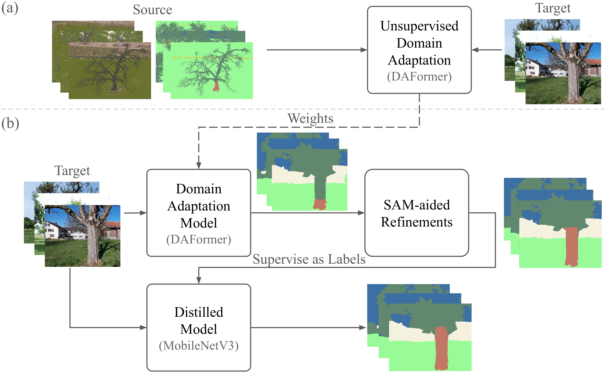

# Real-Time Semantic Segmentation in Natural Environments with SAM-assisted Sim-to-Real Domain Transfer

**by Han Wang, Ruben Mascaro, Margarita Chli, Lucas Teixeira**

## Overview

Semantic segmentation plays a pivotal role in many robotic applications requiring high-level scene understanding, 
such as smart farming, where the precise identification of trees or plants can aid navigation and crop monitoring tasks. 
While deep-learning-based semantic segmentation approaches have reached outstanding performance in recent years, 
they demand large amounts of labeled data for training. 

Inspired by modern **Unsupervised Domain Adaptation (UDA)** techniques, in this paper, 
we introduce a two-step training pipeline specifically tailored to challenging natural scenes, 
where the availability of annotated data is often quite limited.
Our strategy involves the initial training of a powerful **domain adaptive architecture**, 
followed by a refinement stage, 
where segmentation masks predicted by the **Segment Anything Model (SAM)** are used to improve the accuracy of the predictions on the target dataset. 
These refined predictions serve as pseudo-labels to supervise the training of a final distilled architecture for real-time deployment. 

Extensive experiments conducted in two real-world scenes demonstrate the effectiveness of the proposed method. 
Specifically, we show that our pipeline enables the training of a MobileNetV3 that achieves significant mIoU gains of 3.60% and 11.40% on our two datasets 
compared to the DAFormer while only demanding 1/15 of the latter's inference time.



This repository contains the code for this project. For more information on our work, please refer to the [paper](https://arxiv.org/[Link_to_be_replaced]).

If you find this work useful in your research, please consider citing:
```
@InProceedings{wang2024realtime,
  author = {Wang, Han and Mascaro, Ruben and Chli, Margarita and Teixeira, Lucas},
  title = {Real-Time Semantic Segmentation in Natural Environments with SAM-assisted Sim-to-Real Domain Transfer},
  booktitle = {IEEE International Conference on Robotics and Systems (IROS)},
  year = {2024}
}
```
----------------------------
## Datasets
In our work, we use several datasets:

- Source Domain
  - Apple Farm simulation (Winter + Summer)
  - Buildings for CopyPaste
- Target Domain
  - Kastelhof Farm (Winter + Summer)
  - Andreas Park (Winter Only).

You may find the [link](https://drive.google.com/drive/folders/1TrGAJ4aRI2WzPGeU_QOvUos4v5IUetQT?usp=sharing) to the datasets.

----------------------------
## Code Base Instructions


The file structure of the project is as follows:
```
PROJECT_ROOT
├── dataset             | Contains configs, scripts and tools for dataset
│   └── classes.yaml    | Dataset configuration YAML file, to store class names, indices, and palette colors
├── daformer            | DAFormer training and evaluation
├── refinements         | Contains scripts and configs for refining the predictions
├── mmsegmentation      | MobileNetV3 training and evaluation (MMSegmentation full package)
└── uda_helpers         | Helper package for this project
```


### Getting Started
It is recommended to install the dependencies in virtual environments. The following instructions assume that you are using conda.

- Python environments. Two environments are needed: one for DAFormer and one for MobileNetV3. If you are using conda, you can create the environments by running the following commands:
```bash
conda create -n daformer python=3.8.5 -y
conda create -n mmseg python=3.8 -y
```
- Install dependencies for each environments following the instructions in the respective repositories:
    - [DAFormer](./daformer/README.md), or use the commands below
    ```bash
    cd daformer
    conda activate daformer
    conda install cudatoolkit=11.6  # install cuda toolkit on demand
    pip install -r requirements.txt -f https://download.pytorch.org/whl/torch_stable.html
    pip install mmcv-full==1.3.7  # requires the other packages to be installed first
    cd ..
    ```
    - [MMSegmentation](./mmsegmentation/README.md), or use the commands below
    ```bash
    conda activate mmseg
    conda install cudatoolkit=11.6  # install cuda toolkit on demand
    conda install pytorch torchvision -c pytorch
  
    pip install -U openmim
    mim install mmengine
    mim install "mmcv>=2.0.0"
    cd mmsegmentation
    pip install -v -e .
    cd ..
    ```
- Install the helper package for both environments, by running the following command from the project root directory:
```bash
pip install -e uda_helpers
```
- Install `segment-anything` package in any of the training environments (the one you want to run SAM in) by
```bash
pip install git+https://github.com/facebookresearch/segment-anything.git
```


### Data Preparation
A dataset configuration file is provided as `dataset/classes.yaml`.
This file contains the class names, indices, palette colors used in the dataset.

#### Dataset Structure
The following dataset structure (`MMSeg` dataset) is defined in the project:
```
dataset
├── annotations
│   ├── training
│   │   ├── 0001.png
│   │   └── ...
│   └── validation
│       ├── 0002.png
│       └── ...
└── images
    ├── training
    │   ├── 0001.jpg
    │   └── ...
    └── validation
        ├── 0002.jpg
        └── ...
```
Simulation dataset should also contain three `json` files: `sample_class_stats.json`, `sample_class_stats_dict.json`, and `samples_with_class.json`.

#### Copy to DAFormer and MMSegmentation directories
Copy the datasets (or create symbolic links) to the respective `data` directories of DAFormer (`./daformer`) and MMSegmentation (`./mmsegmentation`).
Also make sure that the building crops for copy-paste is stored as `./dataset/building_crops` (adjust the paths in dataset configurations correspondingly).


-------
### Run Inference with Checkpoints
The checkpoints (for DAFormer and MMSegmentation/MobileNetV3, both Kastelhof Farm and Andreas Park datasets) can be downloaded from [Google Drive](https://drive.google.com/drive/folders/1d9bhnO_xAUntVO_u96N4Z_n5FU7016vx?usp=drive_link).
#### DAFormer
Make sure you navigate to the `daformer` directory.
You need a json configuration file, a checkpoint (`.pth`) file, and a directory of images to run inference. Replace the arguments in the square brackets to initiate an inference.
```bash
config_path=[PATH_TO_CONFIG_FILE]
weights=[PATH_TO_WEIGHTS]
image_dir=[YOUR_IMAGE_DIRECTORY]
out_dir=[YOUR_OUTPUT_DIRECTORY]

python -m tools.inference \
"$config_path" \
"$weights" \
--out_dir "$out_dir" --image "$image_dir"
```

#### MMSegmentation
Make sure you navigate to the `mmsegmentation` directory.
You need a python configuration file, a checkpoint (`.pth`) file, and a directory of images to run inference. Replace the arguments in the square brackets to initiate an inference.
```bash
config_path=[PATH_TO_CONFIG_FILE]
weights=[PATH_TO_WEIGHTS]
image_dir=[YOUR_IMAGE_DIRECTORY]
out_dir=[YOUR_OUTPUT_DIRECTORY]

python3 tools/infer.py \
-c "$config_path" \
-w "$weights" \
--image_dir "$image_dir" \
--output img  \
--out_dir "$out_dir"
```
The output can be chosen from the following options:
- `img`: overlaid images of predictions on the original images
- `png`: semantic maps in png format
- `npy`: numpy files of the predictions
- `conf`: confidence
- `none`

-------
### Run Pipeline for Training
#### DAFormer
- Initiate training. Make sure you navigate to the `daformer` directory.
    ```bash
    conda activate daformer
    python3 run_experiments.py --config configs/daformer/daformer_b1_kastelhof.py
    ```
    Replace/Modify the config file as demanded. You may check the original implementation of DAFormer for details.
    By default, the checkpoints are saved in `./work_dirs/local-basic/` with an experiment-specific directory.
- Evaluate results. Evaluations are conducted in either whole images or crops.
  - For whole image evaluation (**Kastelhof Farm**), run the following command and replace your own parameters in the square brackets:
      ```bash
      exp_name=[YOUR_EXPERIMENT_NAME]
      image_dir=[YOUR_IMAGE_DIRECTORY]
      anno_dir=[YOUR_ANNOTATION_DIRECTORY]
      depth_map_dir=[YOUR_DEPTH_MAP_DIRECTORY]
      output=comp_img

      python3 -m tools.evaluate \
    --exp "$exp_name" \
    --image_dir "$image_dir" \
    --anno_dir "$anno_dir" \
    --depth_map_dir "$depth_map_dir" \
    --depth_threshold 15 25 255 \
    --output "$output"
      ```
    You may use command `python3 -m tools.evaluate --help` for more options. 
  - For crop evaluation (**Andreas Park**), add additional arguments to the previous evaluation command: `--with_main_object --ignore_class sky low-vegetation building others --stat_groups tree1 tree2 tree3 tree4`. 
  .
  
  - Outputs may be chosen from the following options:
    - `comp_img`: comparison images of the predictions and the ground-truth annotations
    - `img`: overlaid images of predictions on the original images
    - `none`
    - `npy`: numpy files of the predictions
    - `conf`: confidence
    Same for the following evaluations.
  

- Inference. You need to run inference. Run with the following command and replace your own parameters in the square brackets:
    ```bash
    exp_name=[YOUR_EXPERIMENT_NAME]
    image_dir=[YOUR_IMAGE_DIRECTORY]
    output_directory=[YOUR_OUTPUT_DIRECTORY]

    python3 run_inference.py "$exp_name" \
    --image_dir "$image_dir" \
    --save_dir "$output_directory" \
    --save_png
    ```

#### Refinement

*Preparation*


Before running, you need to execute the following:
- make sure you are in DAFormer or MMSegmentation environment with torch installed.
- install the package `segment-anything` by `pip install git+https://github.com/facebookresearch/segment-anything.git`, if you have not done so.
- download the SAM checkpoint corresponding to the variant you want to use.

*Run refinement*


Switch to the root directory of the project, run with the following command and replace your own parameters in the square brackets:
```bash
task_config=[YOUR_TASK_CONFIG]
image=[YOUR_IMAGE_DIRECTORY_OR_FILE]
pred=[YOUR_PREDICTIONS_DIRECTORY_OR_FILE]
output_directory=[YOUR_OUTPUT_DIRECTORY]

python3 refinements/refine.py \
--tasks "$task_config" \
--image "$image" \
--pred "$pred" \
--out_dir "$output_directory"
```

The default SAM variant to use is ViT-H(`vit_h`) and the default checkpoint is `refinements/vit_h.pth`. 
If you want to use other variants, you can specify the variant by `--variant` and the checkpoint by `--checkpoint`.

You can also specify the verbose level by `--verbose` such that:
- `0`: no output
- `1`: output the step-by-step results
- `2`: output the step-by-step results and all intermediate results

For more details, you can refer to the help message by `python3 refinements/refine.py --help`.

> Note that the prediction inputs for the refinement should be 2D semantic maps in either numpy or png.

##### Construct a Task Config
Make sure you have a task config file in `refinements/tasks` directory.
The task config file should be a python file with its refinement task defined as a list named `refined_tasks`.
Each element in the list should be an instance of `RefinementTask` class.

See `tasks/apple_farm.py` for an example.

- Evaluate results. The following lines of commands can be used for evaluating any semantic maps of pngs. Replace the parameters in the square brackets.
  - To evaluate all classes and whole images (**Kastelhof Farm**)
    ```bash
    pred_dir=[YOUR_PREDICTIONS_DIRECTORY]
    
    python3 -m uda_helpers.eval_png \
    --pred_dir "$pred_dir" \
    --ds_base_dir ./data \
    --ds_dir Apple_Farm_Real
    ```
  - To evaluate crops and ignore some classes (**Andreas Park**), add additional arguments `--with_main_object --ignore_class sky low-vegetation building others --stat_groups tree1 tree2 tree3 tree4`

#### MMSegmentation
- Initiate training
    ```bash
    cd mmsegmentation
    conda activate mmseg
    python3 tools/train.py configs/mobilenet_v3/mobilenet-v3-d8_lraspp_1xb4-20k_apple-farm-512x512.py
    ```
    Replace/Modify the config file as demanded. You may check the MMSegmentation repository for details.
    By default, the checkpoints are saved in `./work_dirs/` with an experiment-specific directory.
- Evaluate results
  - For whole image evaluation (**Kastelhof Farm**)
      ```bash
      exp_name=[YOUR_EXPERIMENT_NAME]
      image_dir=[YOUR_IMAGE_DIRECTORY]
      anno_dir=[YOUR_ANNOTATION_DIRECTORY]
      depth_map_dir=[YOUR_DEPTH_MAP_DIRECTORY]
      output=comp_img

      python3 -m tools.evaluate \
    --exp "$exp_name" \
    --image_dir "$image_dir" \
    --anno_dir "$anno_dir" \
    --depth_map_dir "$depth_map_dir" \
    --depth_threshold 15 25 255 \
    --output "$output"
      ```
    You may use command `python3 -m tools.evaluate --help` for more options. 
  - For crop evaluation (**Andreas Park**), add additional arguments`--with_main_object --ignore_class sky low-vegetation building others --stat_groups tree1 tree2 tree3 tree4`.

- Inference
    ```bash
    cfg_path=[PATH_TO_CONFIG_FILE]
    weights=[PATH_TO_WEIGHTS]
    image_dir=[YOUR_IMAGE_DIRECTORY]
    output_directory=[YOUR_OUTPUT_DIRECTORY]

    python3 tools/infer.py -c "$cfg_path" \
    -w "$weights" \
    --image_dir "$image_dir" \
    --save_dir "$output_directory" \
    --save_png
    ```


### Miscellaneous
#### uda_helpers package
See the [documentation](../uda_helpers/README.md) for the helper package.

#### Checkpoints
You may find our trained checkpoints [here](https://drive.google.com/drive/folders/1d9bhnO_xAUntVO_u96N4Z_n5FU7016vx?usp=sharing).

----------------------------

## Acknowledgements
This project is based on the following open-source projects. We thank their authors for making the source code publicly available.
- [DAFormer](https://github.com/lhoyer/DAFormer/tree/master)
- [MMSegmentation (MobileNetV3)](https://github.com/open-mmlab/mmsegmentation)

<!-- [//]: # (- [Segment Anything Model]&#40;https://github.com/facebookresearch/segment-anything&#41;) -->

## License
This project is released under the MIT License.

**Third-Party Code**

This project builds upon code from DAFormer and MMSegmentation, which are both licensed under the Apache License 2.0.

**License Compliance**

While the overall project is under the MIT License, please note the following:

- The Apache License 2.0 requires that we retain the original copyright notice, license, and any relevant notices from the third-party code.
- Any modifications made to the Apache 2.0 licensed code are clearly noted.

By using this project, you agree to comply with the terms of both the MIT License and the Apache License 2.0 where applicable.
